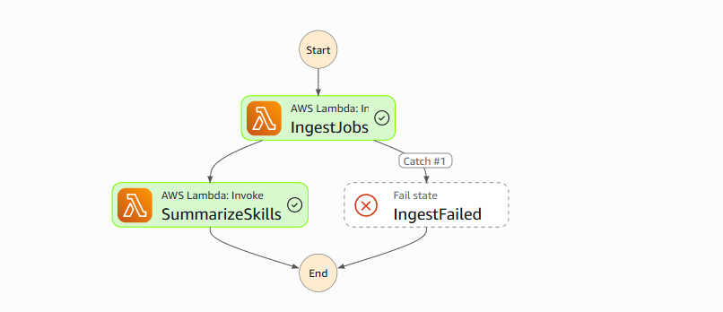

# Job Signal

A serverless pipeline that ingests remote job postings on a schedule, tags them by
skill, and serves the results through a small HTTP API. Built to learn AWS
serverless architecture (Lambda, API Gateway, Step Functions, DynamoDB, EventBridge,
IAM) through a real, non-trivial project rather than isolated tutorials.

## Architecture

```
EventBridge (daily)
        |
        v
Step Functions ---> Lambda: ingest ---> DynamoDB ---> Lambda: query ---> API Gateway
   (retry/catch)     (Remotive API)      (JobSignal)    summarize step        |
                            |                 ^                              v
                            +---> Lambda: summarize (trending skills) ---> HTTP clients
```



_A real execution: both steps succeeded (green), and the `Catch #1` branch to
`IngestFailed` (never triggered here) shows the error-handling path exists
without needing a failure to prove it._

- **EventBridge** triggers the pipeline once a day (`rate(1 day)`).
- **Step Functions** orchestrates two Lambda steps in sequence: `ingest`, then
  `summarize`, with automatic retries on transient failure and a `Catch` branch
  that stops the pipeline cleanly if ingest fails, rather than summarizing stale data.
- **Ingest Lambda** pulls remote software-dev postings from the
  [Remotive API](https://remotive.com/api-documentation), normalizes and
  deduplicates them, and writes them to DynamoDB.
- **Summarize Lambda** reads atomic per-skill counters (updated incrementally by
  ingest on every new posting) via a single `Query`, and writes a daily
  "trending skills" snapshot, with no table scan involved.
- **Query Lambda + API Gateway (HTTP API)** exposes two read-only endpoints over
  plain HTTP.
- **DynamoDB** uses a single-table design with four item shapes sharing one table
  (see below).
- **IAM**: every Lambda has its own execution role scoped to only what it needs:
  ingest/summarize get read+write on the table, query gets read-only, and the
  state machine can only invoke these two specific functions.

## DynamoDB schema

Single table (`JobSignal`), partition key `PK`, sort key `SK`:

| Item type            | PK              | SK                            | Purpose                                                                                                    |
| -------------------- | --------------- | ----------------------------- | ---------------------------------------------------------------------------------------------------------- |
| Canonical job record | `JOB#<job_id>`  | `META`                        | Source of truth per posting, used for dedup                                                                |
| Skill index record   | `SKILL#<skill>` | `<publication_date>#<job_id>` | Fast lookup: "all postings tagged `python`"                                                                |
| Per-skill counter    | `COUNTER`       | `<skill>`                     | Atomically incremented on each new posting (`UpdateItem` + `ADD`); read in one `Query` instead of scanning |
| Daily summary        | `SUMMARY`       | `<date>`                      | Time-series pattern: one partition, sortable by date, so "latest summary" is a single `Query`              |

Each posting fans out into multiple items on write (one canonical record plus one
record per tag), so every read pattern is a direct key lookup, with no scans on the
request path.

## API

Base URL is printed as `ApiUrl` in the `sam deploy` output.

**`GET /jobs?skill=<skill>`**
Returns the most recent postings tagged with the given skill (lowercased, exact match).

```
GET /jobs?skill=python

{"skill": "python", "count": 1, "jobs": [
  {"job_id": "2091081", "title": "Senior Graphic Designer", "company": "Lemon.io", "url": "..."}
]}
```

**`GET /trends`**
Returns the most recent daily summary of tagged-skill counts.

```
GET /trends

{"date": "2026-08-20", "total_tagged_postings": 177, "top_skills": [
  {"skill": "ai/ml", "count": 5}, ...
]}
```

## Running it yourself

Requires an AWS account, the AWS CLI configured (`aws configure`), the
[SAM CLI](https://docs.aws.amazon.com/serverless-application-model/latest/developerguide/install-sam-cli.html),
and Docker.

```bash
sam build --use-container
sam deploy --guided   # first time only; saves config to samconfig.toml
```

To trigger the pipeline manually instead of waiting for the daily schedule:

```bash
aws stepfunctions start-execution \
  --state-machine-arn <StateMachineArn from deploy output> \
  --input '{}'
```

## A note on the data source

This project uses the [Remotive](https://remotive.com) public API, which is free
and requires no API key. Per Remotive's API terms, this project polls at most
once a day and links back to the original posting URL rather than
redistributing content; see the source-attribution note in `src/ingest/app.py`.

## Project structure

```
template.yaml              # SAM/CloudFormation infrastructure definition
statemachine/
  pipeline.asl.json        # Step Functions state machine (Amazon States Language)
src/
  ingest/app.py            # Fetch + normalize + write to DynamoDB, increment skill counters
  summarize/app.py         # Query counters + write trending-skills snapshot
  query/app.py             # API Gateway-backed read endpoints
```

## Possible extensions

- A second data source (e.g. Adzuna) to test the normalization layer against a
  differently-shaped API
- SNS/SES email alert when a posting matches a saved skill profile
- Infrastructure split into nested stacks as the template grows
- Basic unit tests around tag normalization and item-building logic
